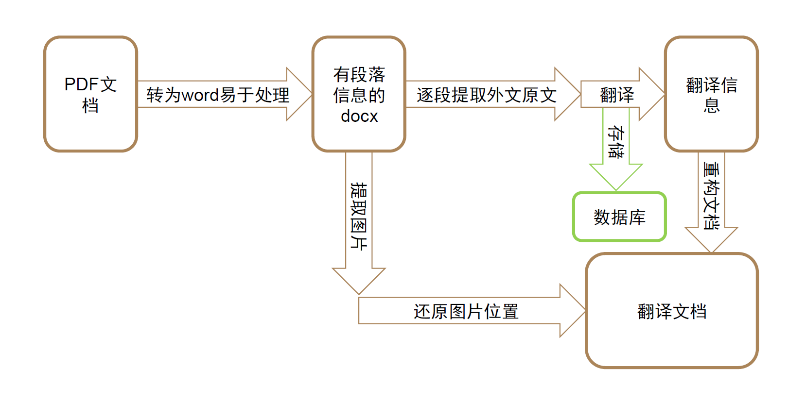

# PDF Document Translation Software Based on LLM / 基于大语言模型的 PDF 文档翻译软件


[English](#english) | [中文](#中文)

---

## 简介 / Introduction

**中文**  
本项目是一个基于大语言模型（LLM）的 PDF 文档翻译工具，支持将 PDF 文件翻译为指定语言，同时保留文档格式。它利用 LLM 的自然语言处理能力，结合 `pymupdf` 和 `pdfplumber` 等库，提取 PDF 内容并生成高质量翻译结果。MongoDB 用于存储翻译数据，另有 HDF5（`T5.py`）作为实验性替代方案。

**English**  
This project is a PDF document translation tool powered by large language models (LLM). It supports translating PDF files into specified languages while preserving document formatting. Leveraging the natural language processing capabilities of LLMs, combined with libraries like `pymupdf` and `pdfplumber`, it extracts PDF content and generates high-quality translations. MongoDB is used for storing translation data, with HDF5 (`T5.py`) as an experimental alternative.

---

## 功能 / Features

- **PDF 文本提取**：使用 `pdfplumber` 和 `pymupdf` 精确提取 PDF 内容。  
- **高质量翻译**：支持通过 OpenAI 或 Azure OpenAI API 进行多语言翻译。  
- **格式保留**：基于 `python-docx` 和 `docxtpl`，确保翻译后文档格式一致。  
- **数据存储**：使用 MongoDB 存储翻译数据，实验性支持 HDF5（`T5.py`）。  
- **可配置性**：通过 `Tconfig.py` 自定义翻译主题、API 配置等。  

---

## 依赖 / Dependencies

以下是项目所需的 Python 库：

```
rich
docxtpl
pdf2docx
python-docx
pymongo
h5py
openai
pymupdf
pdfplumber
```

您可以通过以下命令一次性安装所有依赖：

```bash
pip install -r requirements.txt
```

**注意**：确保已安装 Python 3.8 或以上版本，以及 MongoDB（用于数据存储）。HDF5 支持（`T5.py`）为实验性功能，可能存在不稳定性。

---

## 安装与运行 / Installation and Running

### 前置条件 / Prerequisites
1. 安装 Python 3.8 或以上版本。
2. 安装 MongoDB（或使用 HDF5 替代，详见 `T5.py`，但此功能尚未稳定）。
3. 获取大语言模型的 API Key 和 URL（如 OpenAI 或 Azure OpenAI）。

### 安装步骤 / Installation Steps
1. 克隆本仓库：
   ```bash
   git clone https://github.com/<your-username>/<your-repo>.git
   cd <your-repo>
   ```
2. 安装依赖：
   ```bash
   pip install -r requirements.txt
   ```
3. 安装 MongoDB（参考 [MongoDB 官方文档](https://www.mongodb.com/docs/manual/installation/)）。

### 配置 / Configuration
1. 编辑 `Tconfig.py`：
   - 设置大语言模型的 API Key 和 URL。
   - 配置翻译主题（如目标语言）。
   - 若使用 Azure OpenAI（如 ChatGPT），将 `enable_chatgpt` 设为 `True`，并在 `T24.py` 中提供对应的 URL 和 API Key。
2. 在 `Tmain.py` 中更新 PDF 输入文件的路径为实际文件地址。

### 运行 / Running
运行以下命令启动翻译程序：
```bash
python Tmain.py
```

---

## 工作流程 / Workflow

以下是本软件的工作流程示意图：



1. **输入 PDF**：程序读取用户指定的 PDF 文件。
2. **文本提取**：使用 `pdfplumber` 和 `pymupdf` 提取文本内容。
3. **翻译处理**：通过 LLM API 翻译提取的文本。
4. **格式处理**：利用 `python-docx` 和 `docxtpl` 将翻译结果重新格式化为文档。
5. **存储**：翻译数据存储至 MongoDB（或实验性 HDF5）。
6. **输出**：生成翻译后的文档。

---

## 许可证 / License

本项目基于 **AGPL-3.0 许可证**发布，符合 `pymupdf` 库的要求。详细信息请参阅 [LICENSE](LICENSE) 文件。

---

## 贡献 / Contributing

欢迎为本项目贡献代码！请遵循以下步骤：

1. Fork 本仓库。
2. 创建您的功能分支（`git checkout -b feature/YourFeature`）。
3. 提交更改（`git commit -m 'Add YourFeature'`）。
4. 推送至分支（`git push origin feature/YourFeature`）。
5. 创建 Pull Request。

请确保代码符合 [PEP 8](https://www.python.org/dev/peps/pep-0008/) 规范，并附带必要的测试。

---

## 常见问题 / FAQ

**Q: 为什么 HDF5 支持不稳定？**  
A: `T5.py` 是对 MongoDB 的实验性替代方案，仍在开发中，可能存在数据兼容性或性能问题。

**Q: 支持哪些语言？**  
A: 理论上支持 LLM API 提供的所有语言，具体取决于您使用的模型（如 OpenAI 或 Azure OpenAI）。

**Q: 如何调试运行错误？**  
A: 检查 `Tconfig.py` 中的 API 配置，确保 MongoDB 服务正常运行，并验证 PDF 文件路径是否正确。

---

## 联系 / Contact

如有问题或建议，请在 [GitHub Issues](https://github.com/<your-username>/<your-repo>/issues) 中提交，或联系：<your-email@example.com>。

---

# English

## Introduction
This project is a PDF document translation tool powered by large language models (LLM). It supports translating PDF files into specified languages while preserving document formatting. Leveraging the natural language processing capabilities of LLMs, combined with libraries like `pymupdf` and `pdfplumber`, it extracts PDF content and generates high-quality translations. MongoDB is used for storing translation data, with HDF5 (`T5.py`) as an experimental alternative.

## Features
- **PDF Text Extraction**: Accurately extracts content using `pdfplumber` and `pymupdf`.  
- **High-Quality Translation**: Supports multilingual translation via OpenAI or Azure OpenAI API.  
- **Format Preservation**: Uses `python-docx` and `docxtpl` to maintain document formatting.  
- **Data Storage**: Stores translation data in MongoDB, with experimental HDF5 support (`T5.py`).  
- **Configurability**: Customize translation themes and API settings via `Tconfig.py`.  

## Dependencies
The project requires the following Python libraries:

```
rich
docxtpl
pdf2docx
python-docx
pymongo
h5py
openai
pymupdf
pdfplumber
```

Install all dependencies using:
```bash
pip install -r requirements.txt
```

**Note**: Ensure Python 3.8+ and MongoDB are installed. HDF5 support (`T5.py`) is experimental and may be unstable.

## Installation and Running

### Prerequisites
1. Install Python 3.8 or higher.
2. Install MongoDB (or use HDF5 as an experimental alternative, see `T5.py`).
3. Obtain an API Key and URL for a large language model (e.g., OpenAI or Azure OpenAI).

### Installation Steps
1. Clone the repository:
   ```bash
   git clone https://github.com/<your-username>/<your-repo>.git
   cd <your-repo>
   ```
2. Install dependencies:
   ```bash
   pip install -r requirements.txt
   ```
3. Install MongoDB (refer to [MongoDB official documentation](https://www.mongodb.com/docs/manual/installation/)).

### Configuration
1. Edit `Tconfig.py`:
   - Set the API Key and URL for the large language model.
   - Configure the translation theme (e.g., target language).
   - If using Azure OpenAI (e.g., ChatGPT), set `enable_chatgpt` to `True` and provide the URL and API Key in `T24.py`.
2. Update the PDF input file path in `Tmain.py` to the actual file location.

### Running
Run the following command to start the translation program:
```bash
python Tmain.py
```

## Workflow
The following diagram illustrates the software's workflow:


1. **Input PDF**: The program reads the specified PDF file.
2. **Text Extraction**: Extracts text content using `pdfplumber` and `pymupdf`.
3. **Translation Processing**: Translates extracted text via the LLM API.
4. **Format Processing**: Uses `python-docx` and `docxtpl` to format the translated content.
5. **Storage**: Stores translation data in MongoDB (or experimental HDF5).
6. **Output**: Generates the translated document.

## License
This project is licensed under the **AGPL-3.0 License**, as required by the `pymupdf` library. See the [LICENSE](LICENSE) file for details.

## Contributing
Contributions are welcome! Please follow these steps:

1. Fork the repository.
2. Create a feature branch (`git checkout -b feature/YourFeature`).
3. Commit your changes (`git commit -m 'Add YourFeature'`).
4. Push to the branch (`git push origin feature/YourFeature`).
5. Create a Pull Request.

Ensure code adheres to [PEP 8](https://www.python.org/dev/peps/pep-0008/) standards and includes necessary tests.

## FAQ
**Q: Why is HDF5 support unstable?**  
A: `T5.py` is an experimental alternative to MongoDB and may have data compatibility or performance issues.

**Q: Which languages are supported?**  
A: The tool supports all languages provided by the LLM API (e.g., OpenAI or Azure OpenAI).

**Q: How do I debug runtime errors?**  
A: Verify API settings in `Tconfig.py`, ensure MongoDB is running, and check the PDF file path.

## Contact
For questions or suggestions, please open an issue on [GitHub Issues](https://github.com/<your-username>/<your-repo>/issues) or contact: <your-email@example.com>.

